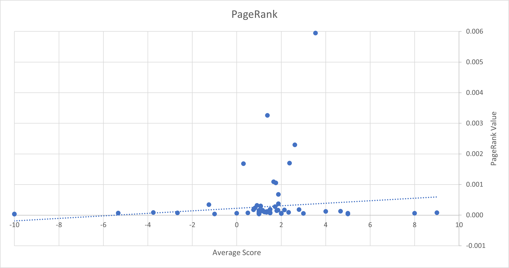

# Results
## BFS
After using BFS, to find the shortest path, we discovered that all of the vertices are part of the same "island", which was contrary to our expectations. This is known because in our executable, for most of the options for the starting vertex, the same list for connected vertices is printed:
```
Insert a vertex to end at. Choose from:

1 2 3 4 5 6 7 8 9 10 13 15 16 17 19 20 21 23...5997 5998 5999 6003 6004 6005
```
The only exceptions are for vertices without an outgoing edge. For example, `20`, which yielded the following path in our executable:
```
20
0 edges crossed
```
We can reasonably expect in the dataset, which contains 5,881 vertices, that there are more vertices with only incoming edges. 

Another unexpected result from our BFS shortest path algorithm was discovering many of our shortest paths were shorter than expected for a large dataset. Here is a sample of 5 randomly generated shortest paths:
```
745 to 241 : 745 -> 633 -> 64 -> 249 -> 241 -------- Length: 4
3973 to 1312 : 3973 -> 3669 -> 664 -> 1352 -> 1312 -------- Length: 4
2641 to 3143 : 2681 -> 2485 -> 1334 -> 4197 -> 3143 -------- Length: 4
4748 to 1933 : 4748 -> 3897 -> 905 -> 1933 -------- Length: 3
1980 to 5009 : 1890 -> 905 -> 4559 -> 5009 -------- Length: 3
```

When putting in random start and end vertices, we never got a path longer than 4. This was surprising because the dataset contains 5,881 vertices. This is likely caused by the amount of edges in the graph. The graph has 35,592 edges, which means each vertex has an average of 6.052 outgoing edges. This causes the graph to be highly connected, reducing the amount of vertices needed to cross to get from A to B.

## PageRank
After running PageRank on the vertices in the path found by BFS we were able to see that some of the nodes followed our assumption that if a user has a higher average rating then they'll also have a higher PageRank value and viceversa. For example, when comparing vertices 1 and 6004 we get:

| Vertex | PageRank    | Average Rating |
| ------ | ----------- | -------------- |
| 1      | 0.00594806  | 3.54425        |
| 6004   | 5.15791e-05 | 1              |

In this case, vertex 1 which has a higher average rating also has a higher pageRank value which makes sense under our assumption that a user that gets rated as more trustworthy on average is more likely for a someone to want to trade with them. However, there were other cases that ran contrary to this assumption. For vertices 1 and 35 the results were:


| Vertex | PageRank    | Average Rating |
| ------ | ----------- | -------------- |
| 1      | 0.00594806  | 3.54425        |
| 35     | 0.015492    | 1.89907        |

In this case vertex 1 has a higher average rating, but vertex 35 has a higher pageRank number. This runs contrary to our original assumption but makes sense considering how pageRank works. While our implementation takes the scores as edge weights into account these don't strictly increase a vertex's pageRank value. Since pageRank makes it so each vertex distributes it's pageRank value between it's neighbours according to the weight of their edges we could have the following scenario:

```
[a]<--10--[b]--10-->[c]    [d]<--1--[e]--1-->[f]    [g]<--10--[h]--1-->[i]
```

Let b, e and h have the same pageRank value and the next step is distribute it's pageRank among it's neighbors. Since edges b-a and b-c have the same weights they get an equal distribution of vertex b's pageRank and the same can be said of d and f receiving an equal distribution of e's pageRank. Even though the weights in both components are different they result in the same outcome due to how they compare to the other edges found in the vertex. For a score of for example 10 to have a different effect than a score of 1 they would have to be outgoing from the same vertex like in g-h-i. Taking this into account we can correct our assumption by saying that a higher average rating by itself doesn't result in a higher pageRank value but that instead a higher average rating relative to a user's other reviews results in a higher pageRank.

We also randomly sampled 100 vertices to examine if there's a correlation between the average Rating and PageRank value for a vertex. Our sample revealed a correlation coefficient of 0.129492309. From this, we can conlclude a very weak correlation between the two variables. This was the resulting Graph from Excel, as well as a trendline:


